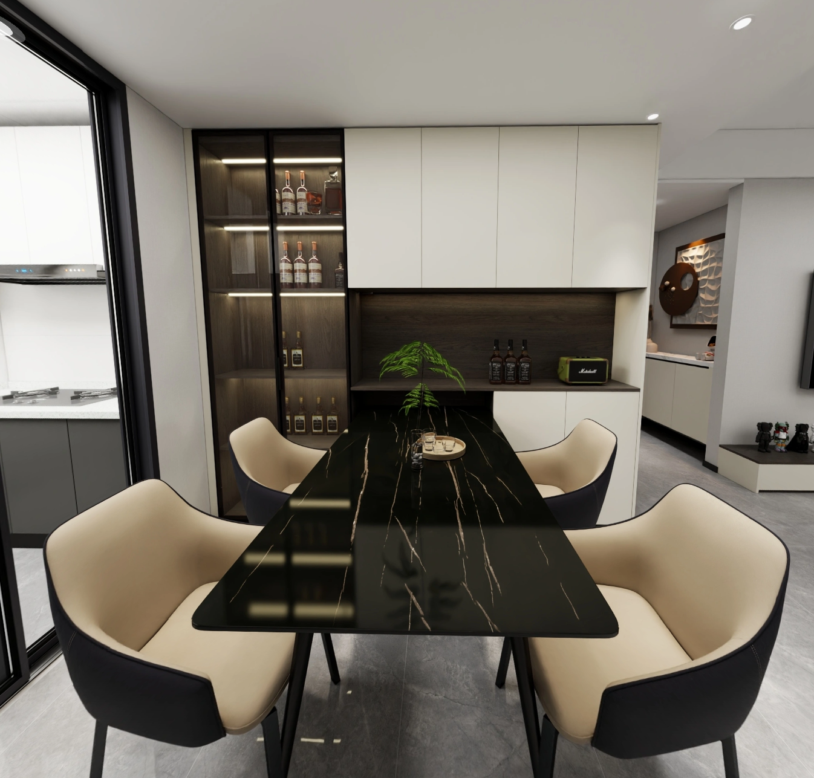

# 海玥铭邸装修

## 需求&家具

### 客厅

- 满墙电视柜（东），未确定电视机方案
  - 电视柜尺寸深度35-40厘米
- 沙发（西），未确定尺寸大小以及功能
  - 希望是个电动展开的沙发
  - 还希望买个单独的类似头等舱沙发

### 餐厅

- 餐边柜
  - 深度35-40厘米
  - 开放格高度60厘米以上
- 餐桌
  - 长度推荐1.6米，平时部分长度隐藏在餐边柜内，如果选择1.4米，则可能椅子无法放下。
  - 如若选择1.4米，则需要考虑椅子的大小

#### 推荐方案一

### 主卧

- 衣柜
  - 深度55-65厘米
- 八百柜（门后）
  - 深度？
- 窗改内倒

### 次卧

- 衣柜
  - 深度55-65厘米
- 窗改内倒或者门，若门则作为平台的进出入口

### 书房

### 阳台

- 包阳台
- 阳台柜子（西）
- 洗衣机
- 烘干机
- 扫拖机器人

### 厨房

- 冰箱预留尺寸？

### 主卫

- 暂无

### 次卫

- 暂无

### 电梯

- 柜子，注意消防的位置
  - 深度35-40厘米

### 平台

- 未确定方案
- 设想可以在上面铺设塑木，养养花之类

